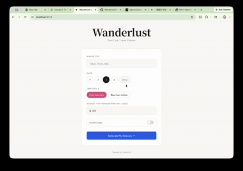

# ✦ Wanderlust — One-Click Travel Planner

Enter a destination, budget, and trip length — get restaurant picks, attractions, hotel recommendations, and a day-by-day schedule with real prices sourced from the web.



## Getting Started

```bash
git clone https://github.com/YOUR_USERNAME/Wanderlust.git
cd Wanderlust
npm install
```

Create a `.env` file:

```
VITE_GEMINI_KEY=your_gemini_api_key
```

Get a free key at [aistudio.google.com/apikey](https://aistudio.google.com/apikey), then:

```bash
npm run dev
```

Open `http://localhost:5173`.

## Tech Stack

| Layer     | Tech                              |
| --------- | --------------------------------- |
| Frontend  | React 18, Vite                    |
| AI        | Google Gemini 2.5 Flash API       |
| Styling   | CSS Variables + Inline Styles     |
| Fonts     | Noto Serif JP, Zen Maru Gothic    |

## License

MIT
